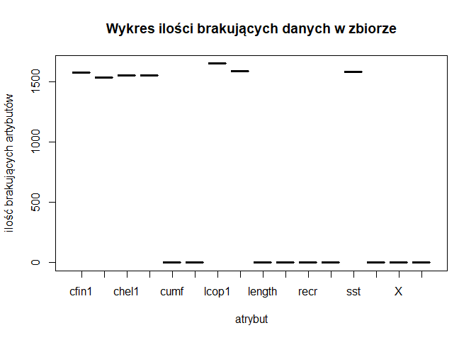

data wygenerowania: ‘2019-październik-24’

Podsumowanie badań
==================

//TODO podsumowanie calego raportu

Wykorzystane biblioteki
=======================

//TODO Kod wyliczający wykorzystane biblioteki. library(plotly)

Zapewnienie powtarzalności wyników przy każdym uruchomieniu raportu na tych samych danych
=========================================================================================

    set.seed(23)

Wczytywanie danych z pliku
==========================

    names <- read.table("sledzie.csv", nrow=1, stringsAsFactors = FALSE, sep = ",")
    data <- read.table("sledzie.csv", header=TRUE,, stringsAsFactors = FALSE, sep=",")
    head(data)

    ##   X length   cfin1   cfin2   chel1    chel2   lcop1    lcop2  fbar   recr
    ## 1 0   23.0 0.02778 0.27785 2.46875        ? 2.54787 26.35881 0.356 482831
    ## 2 1   22.5 0.02778 0.27785 2.46875 21.43548 2.54787 26.35881 0.356 482831
    ## 3 2   25.0 0.02778 0.27785 2.46875 21.43548 2.54787 26.35881 0.356 482831
    ## 4 3   25.5 0.02778 0.27785 2.46875 21.43548 2.54787 26.35881 0.356 482831
    ## 5 4   24.0 0.02778 0.27785 2.46875 21.43548 2.54787 26.35881 0.356 482831
    ## 6 5   22.0 0.02778 0.27785 2.46875 21.43548 2.54787        ? 0.356 482831
    ##        cumf   totaln           sst      sal xmonth nao
    ## 1 0.3059879 267380.8 14.3069330186 35.51234      7 2.8
    ## 2 0.3059879 267380.8 14.3069330186 35.51234      7 2.8
    ## 3 0.3059879 267380.8 14.3069330186 35.51234      7 2.8
    ## 4 0.3059879 267380.8 14.3069330186 35.51234      7 2.8
    ## 5 0.3059879 267380.8 14.3069330186 35.51234      7 2.8
    ## 6 0.3059879 267380.8 14.3069330186 35.51234      7 2.8

    sapply(data, class)

    ##           X      length       cfin1       cfin2       chel1       chel2 
    ##   "integer"   "numeric" "character" "character" "character" "character" 
    ##       lcop1       lcop2        fbar        recr        cumf      totaln 
    ## "character" "character"   "numeric"   "integer"   "numeric"   "numeric" 
    ##         sst         sal      xmonth         nao 
    ## "character"   "numeric"   "integer"   "numeric"

Zmiana “?” na “NA” wraz ze zmianą typu danych z character na numeric:

    data[data=="?"] <- NA

    data$cfin1 <- as.numeric(data$cfin1)
    data$cfin2 <- as.numeric(data$cfin2)
    data$chel1 <- as.numeric(data$chel1)
    data$chel2 <- as.numeric(data$chel2)
    data$lcop1 <- as.numeric(data$lcop1)
    data$lcop2 <- as.numeric(data$lcop2)
    data$sst <- as.numeric(data$sst)

    head(data)

    ##   X length   cfin1   cfin2   chel1    chel2   lcop1    lcop2  fbar   recr
    ## 1 0   23.0 0.02778 0.27785 2.46875       NA 2.54787 26.35881 0.356 482831
    ## 2 1   22.5 0.02778 0.27785 2.46875 21.43548 2.54787 26.35881 0.356 482831
    ## 3 2   25.0 0.02778 0.27785 2.46875 21.43548 2.54787 26.35881 0.356 482831
    ## 4 3   25.5 0.02778 0.27785 2.46875 21.43548 2.54787 26.35881 0.356 482831
    ## 5 4   24.0 0.02778 0.27785 2.46875 21.43548 2.54787 26.35881 0.356 482831
    ## 6 5   22.0 0.02778 0.27785 2.46875 21.43548 2.54787       NA 0.356 482831
    ##        cumf   totaln      sst      sal xmonth nao
    ## 1 0.3059879 267380.8 14.30693 35.51234      7 2.8
    ## 2 0.3059879 267380.8 14.30693 35.51234      7 2.8
    ## 3 0.3059879 267380.8 14.30693 35.51234      7 2.8
    ## 4 0.3059879 267380.8 14.30693 35.51234      7 2.8
    ## 5 0.3059879 267380.8 14.30693 35.51234      7 2.8
    ## 6 0.3059879 267380.8 14.30693 35.51234      7 2.8

    sapply(data, class)

    ##         X    length     cfin1     cfin2     chel1     chel2     lcop1 
    ## "integer" "numeric" "numeric" "numeric" "numeric" "numeric" "numeric" 
    ##     lcop2      fbar      recr      cumf    totaln       sst       sal 
    ## "numeric" "numeric" "integer" "numeric" "numeric" "numeric" "numeric" 
    ##    xmonth       nao 
    ## "integer" "numeric"

Brakujące dane
==============

//TODO Kod przetwarzający brakujące dane.

Rozmiar zbioru i statystyki
===========================

Sekcja podsumowująca rozmiar zbioru i podstawowe statystyki.

    paste("Wczytane dane zawierają ", nrow(data), " rekordów oraz ", ncol(data), " kolumn.", sep=" ")

    ## [1] "Wczytane dane zawierają  52582  rekordów oraz  16  kolumn."

Podsumowanie wartości danych:

    summary(data)

    ##        X             length         cfin1             cfin2        
    ##  Min.   :    0   Min.   :19.0   Min.   : 0.0000   Min.   : 0.0000  
    ##  1st Qu.:13145   1st Qu.:24.0   1st Qu.: 0.0000   1st Qu.: 0.2778  
    ##  Median :26291   Median :25.5   Median : 0.1111   Median : 0.7012  
    ##  Mean   :26291   Mean   :25.3   Mean   : 0.4458   Mean   : 2.0248  
    ##  3rd Qu.:39436   3rd Qu.:26.5   3rd Qu.: 0.3333   3rd Qu.: 1.7936  
    ##  Max.   :52581   Max.   :32.5   Max.   :37.6667   Max.   :19.3958  
    ##                                 NA's   :1581      NA's   :1536     
    ##      chel1            chel2            lcop1              lcop2       
    ##  Min.   : 0.000   Min.   : 5.238   Min.   :  0.3074   Min.   : 7.849  
    ##  1st Qu.: 2.469   1st Qu.:13.427   1st Qu.:  2.5479   1st Qu.:17.808  
    ##  Median : 5.750   Median :21.673   Median :  7.0000   Median :24.859  
    ##  Mean   :10.006   Mean   :21.221   Mean   : 12.8108   Mean   :28.419  
    ##  3rd Qu.:11.500   3rd Qu.:27.193   3rd Qu.: 21.2315   3rd Qu.:37.232  
    ##  Max.   :75.000   Max.   :57.706   Max.   :115.5833   Max.   :68.736  
    ##  NA's   :1555     NA's   :1556     NA's   :1653       NA's   :1591    
    ##       fbar             recr              cumf             totaln       
    ##  Min.   :0.0680   Min.   : 140515   Min.   :0.06833   Min.   : 144137  
    ##  1st Qu.:0.2270   1st Qu.: 360061   1st Qu.:0.14809   1st Qu.: 306068  
    ##  Median :0.3320   Median : 421391   Median :0.23191   Median : 539558  
    ##  Mean   :0.3304   Mean   : 520367   Mean   :0.22981   Mean   : 514973  
    ##  3rd Qu.:0.4560   3rd Qu.: 724151   3rd Qu.:0.29803   3rd Qu.: 730351  
    ##  Max.   :0.8490   Max.   :1565890   Max.   :0.39801   Max.   :1015595  
    ##                                                                        
    ##       sst             sal            xmonth            nao          
    ##  Min.   :12.77   Min.   :35.40   Min.   : 1.000   Min.   :-4.89000  
    ##  1st Qu.:13.60   1st Qu.:35.51   1st Qu.: 5.000   1st Qu.:-1.89000  
    ##  Median :13.86   Median :35.51   Median : 8.000   Median : 0.20000  
    ##  Mean   :13.87   Mean   :35.51   Mean   : 7.258   Mean   :-0.09236  
    ##  3rd Qu.:14.16   3rd Qu.:35.52   3rd Qu.: 9.000   3rd Qu.: 1.63000  
    ##  Max.   :14.73   Max.   :35.61   Max.   :12.000   Max.   : 5.08000  
    ##  NA's   :1584

Ilość brakujących danych dla poszczególnych kolumn:

    missingData <- sapply(data, function(x) sum(is.na(x)))
    missingData

    ##      X length  cfin1  cfin2  chel1  chel2  lcop1  lcop2   fbar   recr 
    ##      0      0   1581   1536   1555   1556   1653   1591      0      0 
    ##   cumf totaln    sst    sal xmonth    nao 
    ##      0      0   1584      0      0      0

Wykres ilości brakujących danych w zbiorze:

    library(plotly)

    ## Loading required package: ggplot2

    ## 
    ## Attaching package: 'plotly'

    ## The following object is masked from 'package:ggplot2':
    ## 
    ##     last_plot

    ## The following object is masked from 'package:stats':
    ## 
    ##     filter

    ## The following object is masked from 'package:graphics':
    ## 
    ##     layout

    packageVersion('plotly')

    ## [1] '4.9.0'

    plot(x = factor(names(missingData)), y = missingData, main="Wykres ilości brakujących danych w zbiorze", xlab="atrybut", ylab = "ilość brakujących artybutów")

Szczegółowa analiza zbiorów wartości
====================================

//TODO Szczegółowa analiza wartości atrybutów (np. poprzez prezentację
rozkładów wartości).

Korelacja między zmiennymi
==========================

//TODO Sekcja sprawdzająca korelacje między zmiennymi; sekcja ta powinna
zawierać jakąś formę graficznej prezentacji korelacji.

Zmiana rozmiaru śledzia w czasie
================================

//TODO Interaktywny wykres lub animację prezentującą zmianę rozmiaru
śledzi w czasie.

Przewidywanie rozmiaru śledzia
==============================

//TODO Sekcję próbującą stworzyć regresor przewidujący rozmiar śledzia
(w tej sekcji należy wykorzystać wiedzę z pozostałych punktów oraz
wykonać dodatkowe czynności, które mogą poprawić trafność predykcji);
dobór parametrów modelu oraz oszacowanie jego skuteczności powinny
zostać wykonane za pomocą techniki podziału zbioru na dane uczące,
walidujące i testowe; trafność regresji powinna zostać oszacowana na
podstawie miar R2 i RMSE.

Analiza ważnośći atrybutów najlepszego znalezionego modelu regresji
===================================================================

//TODO Analiza ważności atrybutów najlepszego znalezionego modelu
regresji. Analiza ważności atrybutów powinna stanowić próbę odpowiedzi
na pytanie: co sprawia, że rozmiar śledzi zaczął w pewnym momencie
maleć.
