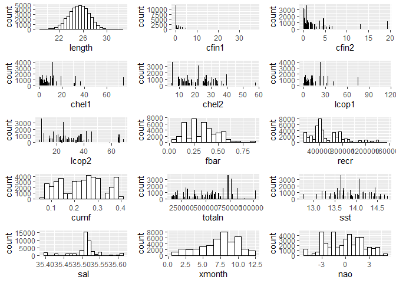
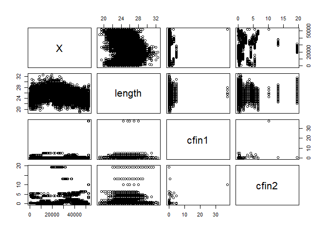
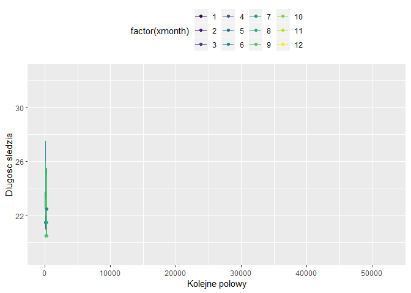

-   [Podsumowanie badań](#podsumowanie-badań)
-   [Wykorzystane biblioteki](#wykorzystane-biblioteki)
-   [Zapewnienie powtarzalności wyników przy każdym uruchomieniu raportu
    na tych samych
    danych](#zapewnienie-powtarzalności-wyników-przy-każdym-uruchomieniu-raportu-na-tych-samych-danych)
-   [Wstęp](#wstęp)
-   [Wczytywanie danych z pliku](#wczytywanie-danych-z-pliku)
-   [Rozmiar zbioru danych i podstawowe
    statystyki](#rozmiar-zbioru-danych-i-podstawowe-statystyki)
-   [Brakujące dane](#brakujące-dane)
-   [Szczegółowa analiza zbiorów
    wartości](#szczegółowa-analiza-zbiorów-wartości)
-   [Korelacja między zmiennymi](#korelacja-między-zmiennymi)
-   [Zmiana rozmiaru śledzia w
    czasie](#zmiana-rozmiaru-śledzia-w-czasie)
-   [Przewidywanie rozmiaru śledzia](#przewidywanie-rozmiaru-śledzia)
-   [Analiza ważnośći atrybutów najlepszego znalezionego modelu
    regresji](#analiza-ważnośći-atrybutów-najlepszego-znalezionego-modelu-regresji)

data wygenerowania: ‘2019-listopad-02’

Podsumowanie badań
==================

***\[TODO\]*** podsumowanie calego raportu

Wykorzystane biblioteki
=======================

Do analizy danych i stworzenia raportu z tej analizy zostały
wykorzystane następujące biblioteki: - datasets  
- corrplot  
- ggplot2  
- gganimate  
- dplyr  
- gridExtra  
- gifski package

Zapewnienie powtarzalności wyników przy każdym uruchomieniu raportu na tych samych danych
=========================================================================================

Aby zapewnić powtarzalność próbkowań i losowań liczb (m. inn. przy
próbkowaniu zbioru) przy każdym odpaleniu programu ustawiono stałe
ziarno.

    set.seed(23)

Wstęp
=====

W podanym sprawozdaniu użyto zbioru danych sledzie.csv pobranego ze
strony
<a href="http://www.cs.put.poznan.pl/alabijak/emd/projekt/sledzie.csv" class="uri">http://www.cs.put.poznan.pl/alabijak/emd/projekt/sledzie.csv</a>
. Zbiór ten opisuje rozmiary śledzi i warunki, w których żyją od 60-ciu
lat. Kolejne kolumny w zbiorze danych to:  
\* **length**: długość złowionego śledzia \[cm\];  
\* **cfin1**: dostępność planktonu \[zagęszczenie Calanus finmarchicus
gat. 1\];  
\* **cfin2**: dostępność planktonu \[zagęszczenie Calanus finmarchicus
gat. 2\];  
\* **chel1**: dostępność planktonu \[zagęszczenie Calanus helgolandicus
gat. 1\];  
\* **chel2**: dostępność planktonu \[zagęszczenie Calanus helgolandicus
gat. 2\];  
\* **lcop1**: dostępność planktonu \[zagęszczenie widłonogów gat. 1\];  
\* **lcop2**: dostępność planktonu \[zagęszczenie widłonogów gat. 2\];  
\* **fbar**: natężenie połowów w regionie \[ułamek pozostawionego
narybku\];  
\* **recr**: roczny narybek \[liczba śledzi\];  
\* **cumf**: łączne roczne natężenie połowów w regionie \[ułamek
pozostawionego narybku\];  
\* **totaln**: łączna liczba ryb złowionych w ramach połowu \[liczba
śledzi\];  
\* **sst**: temperatura przy powierzchni wody \[°C\];  
\* **sal**: poziom zasolenia wody \[Knudsen ppt\];  
\* **xmonth**: miesiąc połowu \[numer miesiąca\];  
\* **nao**: oscylacja północnoatlantycka \[mb\].  
Wiersze w zbiorze są uporządkowane chronologicznie.

Wczytywanie danych z pliku
==========================

    names <- read.table("sledzie.csv", nrow=1, stringsAsFactors = FALSE, sep = ",")
    data <- read.table("sledzie.csv", header=TRUE, stringsAsFactors = FALSE, sep=",")
    head(data)

    ##   X length   cfin1   cfin2   chel1    chel2   lcop1    lcop2  fbar   recr
    ## 1 0   23.0 0.02778 0.27785 2.46875        ? 2.54787 26.35881 0.356 482831
    ## 2 1   22.5 0.02778 0.27785 2.46875 21.43548 2.54787 26.35881 0.356 482831
    ## 3 2   25.0 0.02778 0.27785 2.46875 21.43548 2.54787 26.35881 0.356 482831
    ## 4 3   25.5 0.02778 0.27785 2.46875 21.43548 2.54787 26.35881 0.356 482831
    ## 5 4   24.0 0.02778 0.27785 2.46875 21.43548 2.54787 26.35881 0.356 482831
    ## 6 5   22.0 0.02778 0.27785 2.46875 21.43548 2.54787        ? 0.356 482831
    ##        cumf   totaln           sst      sal xmonth nao
    ## 1 0.3059879 267380.8 14.3069330186 35.51234      7 2.8
    ## 2 0.3059879 267380.8 14.3069330186 35.51234      7 2.8
    ## 3 0.3059879 267380.8 14.3069330186 35.51234      7 2.8
    ## 4 0.3059879 267380.8 14.3069330186 35.51234      7 2.8
    ## 5 0.3059879 267380.8 14.3069330186 35.51234      7 2.8
    ## 6 0.3059879 267380.8 14.3069330186 35.51234      7 2.8

Jak widać, wczytane dane zawierają znak “?” przy nieznanych danych.

Wyświetlenie klas poszczególnych kolumn:

    sapply(data, class)

    ##           X      length       cfin1       cfin2       chel1       chel2 
    ##   "integer"   "numeric" "character" "character" "character" "character" 
    ##       lcop1       lcop2        fbar        recr        cumf      totaln 
    ## "character" "character"   "numeric"   "integer"   "numeric"   "numeric" 
    ##         sst         sal      xmonth         nao 
    ## "character"   "numeric"   "integer"   "numeric"

Dane zawierające znak “?” zostały zinterpretowane jako tekst. Zmiana “?”
na “NA” wraz ze zmianą typu danych z character na numeric:

    data[data=="?"] <- NA

Po zmianie znaku “?” na wartość NA zmianiono typ danych kolumn z
nieznanymi wartościami na wartości numeryczne.

    data$cfin1 <- as.numeric(data$cfin1)
    data$cfin2 <- as.numeric(data$cfin2)
    data$chel1 <- as.numeric(data$chel1)
    data$chel2 <- as.numeric(data$chel2)
    data$lcop1 <- as.numeric(data$lcop1)
    data$lcop2 <- as.numeric(data$lcop2)
    data$sst <- as.numeric(data$sst)

    head(data)

    ##   X length   cfin1   cfin2   chel1    chel2   lcop1    lcop2  fbar   recr
    ## 1 0   23.0 0.02778 0.27785 2.46875       NA 2.54787 26.35881 0.356 482831
    ## 2 1   22.5 0.02778 0.27785 2.46875 21.43548 2.54787 26.35881 0.356 482831
    ## 3 2   25.0 0.02778 0.27785 2.46875 21.43548 2.54787 26.35881 0.356 482831
    ## 4 3   25.5 0.02778 0.27785 2.46875 21.43548 2.54787 26.35881 0.356 482831
    ## 5 4   24.0 0.02778 0.27785 2.46875 21.43548 2.54787 26.35881 0.356 482831
    ## 6 5   22.0 0.02778 0.27785 2.46875 21.43548 2.54787       NA 0.356 482831
    ##        cumf   totaln      sst      sal xmonth nao
    ## 1 0.3059879 267380.8 14.30693 35.51234      7 2.8
    ## 2 0.3059879 267380.8 14.30693 35.51234      7 2.8
    ## 3 0.3059879 267380.8 14.30693 35.51234      7 2.8
    ## 4 0.3059879 267380.8 14.30693 35.51234      7 2.8
    ## 5 0.3059879 267380.8 14.30693 35.51234      7 2.8
    ## 6 0.3059879 267380.8 14.30693 35.51234      7 2.8

    sapply(data, class)

    ##         X    length     cfin1     cfin2     chel1     chel2     lcop1 
    ## "integer" "numeric" "numeric" "numeric" "numeric" "numeric" "numeric" 
    ##     lcop2      fbar      recr      cumf    totaln       sst       sal 
    ## "numeric" "numeric" "integer" "numeric" "numeric" "numeric" "numeric" 
    ##    xmonth       nao 
    ## "integer" "numeric"

***\[TODO\]*** może to jakoś ładniej zrobić “as.numeric” a nie tak
brzydko powtarzając kod

Rozmiar zbioru danych i podstawowe statystyki
=============================================

    paste("Wczytane dane zawierają ", nrow(data), " rekordów oraz ", ncol(data), " kolumn.", sep=" ")

    ## [1] "Wczytane dane zawierają  52582  rekordów oraz  16  kolumn."

Podsumowanie wartości danych:

    summary(data)

    ##        X             length         cfin1             cfin2        
    ##  Min.   :    0   Min.   :19.0   Min.   : 0.0000   Min.   : 0.0000  
    ##  1st Qu.:13145   1st Qu.:24.0   1st Qu.: 0.0000   1st Qu.: 0.2778  
    ##  Median :26291   Median :25.5   Median : 0.1111   Median : 0.7012  
    ##  Mean   :26291   Mean   :25.3   Mean   : 0.4458   Mean   : 2.0248  
    ##  3rd Qu.:39436   3rd Qu.:26.5   3rd Qu.: 0.3333   3rd Qu.: 1.7936  
    ##  Max.   :52581   Max.   :32.5   Max.   :37.6667   Max.   :19.3958  
    ##                                 NA's   :1581      NA's   :1536     
    ##      chel1            chel2            lcop1              lcop2       
    ##  Min.   : 0.000   Min.   : 5.238   Min.   :  0.3074   Min.   : 7.849  
    ##  1st Qu.: 2.469   1st Qu.:13.427   1st Qu.:  2.5479   1st Qu.:17.808  
    ##  Median : 5.750   Median :21.673   Median :  7.0000   Median :24.859  
    ##  Mean   :10.006   Mean   :21.221   Mean   : 12.8108   Mean   :28.419  
    ##  3rd Qu.:11.500   3rd Qu.:27.193   3rd Qu.: 21.2315   3rd Qu.:37.232  
    ##  Max.   :75.000   Max.   :57.706   Max.   :115.5833   Max.   :68.736  
    ##  NA's   :1555     NA's   :1556     NA's   :1653       NA's   :1591    
    ##       fbar             recr              cumf             totaln       
    ##  Min.   :0.0680   Min.   : 140515   Min.   :0.06833   Min.   : 144137  
    ##  1st Qu.:0.2270   1st Qu.: 360061   1st Qu.:0.14809   1st Qu.: 306068  
    ##  Median :0.3320   Median : 421391   Median :0.23191   Median : 539558  
    ##  Mean   :0.3304   Mean   : 520367   Mean   :0.22981   Mean   : 514973  
    ##  3rd Qu.:0.4560   3rd Qu.: 724151   3rd Qu.:0.29803   3rd Qu.: 730351  
    ##  Max.   :0.8490   Max.   :1565890   Max.   :0.39801   Max.   :1015595  
    ##                                                                        
    ##       sst             sal            xmonth            nao          
    ##  Min.   :12.77   Min.   :35.40   Min.   : 1.000   Min.   :-4.89000  
    ##  1st Qu.:13.60   1st Qu.:35.51   1st Qu.: 5.000   1st Qu.:-1.89000  
    ##  Median :13.86   Median :35.51   Median : 8.000   Median : 0.20000  
    ##  Mean   :13.87   Mean   :35.51   Mean   : 7.258   Mean   :-0.09236  
    ##  3rd Qu.:14.16   3rd Qu.:35.52   3rd Qu.: 9.000   3rd Qu.: 1.63000  
    ##  Max.   :14.73   Max.   :35.61   Max.   :12.000   Max.   : 5.08000  
    ##  NA's   :1584

Ilość brakujących danych dla poszczególnych kolumn:

    missingData <- sapply(data, function(x) sum(is.na(x)))
    missingData

    ##      X length  cfin1  cfin2  chel1  chel2  lcop1  lcop2   fbar   recr 
    ##      0      0   1581   1536   1555   1556   1653   1591      0      0 
    ##   cumf totaln    sst    sal xmonth    nao 
    ##      0      0   1584      0      0      0

    class(missingData)

    ## [1] "integer"

Wykres ilości brakujących danych w zbiorze:

    plot(x = factor(names(missingData)), y = missingData, main="Wykres ilości brakujących danych w zbiorze", xlab="atrybut", ylab = "ilość brakujących artybutów")

Jak widać zbiór danych zawiera znaczną ilość brakujących danych, co może
utrudnić ich późniejszą analizę.

Brakujące dane
==============

***\[TODO\]*** Kod przetwarzający brakujące dane.

data*c**f**i**n*1 &lt;  − *n**a**k**a**l**m**a**n*(*d**a**t**a*cfin1)
data*c**f**i**n*2 &lt;  − *n**a**k**a**l**m**a**n*(*d**a**t**a*cfin2)
data*c**h**e**l*1 &lt;  − *n**a**k**a**l**m**a**n*(*d**a**t**a*chel1)
data*c**h**e**l*2 &lt;  − *n**a**k**a**l**m**a**n*(*d**a**t**a*chel2)
data*l**c**o**p*1 &lt;  − *n**a**k**a**l**m**a**n*(*d**a**t**a*lcop1)
data*l**c**o**p*2 &lt;  − *n**a**k**a**l**m**a**n*(*d**a**t**a*lcop2)
data*s**s**t* &lt;  − *n**a**k**a**l**m**a**n*(*d**a**t**a*sst)

head(data)

Szczegółowa analiza zbiorów wartości
====================================

Poniżej przedstawiono rozkłady wszystkich wartośi w zbiorze danych  
***\[TODO\]*** Ogarnąć brakujące wartości - chyba że *na.omit(data)*
jest ok?  
***\[TODO\]*** Zrobić te wykresy troche szersze i wyższe  
***\[TODO\]*** Ogarnąć żeby nie wyświetlać warningów: " Warning:
Ignoring unknown parameters: binwidth, bins, pad"

    library(ggplot2)
    library(ggExtra)

    lengthDissPlot <- ggplot(na.omit(data), aes(x=length)) + geom_histogram(binwidth=.5, colour="black", fill="white")
    cfin1DissPlot <- ggplot(na.omit(data), aes(x=cfin1)) + geom_histogram(binwidth=1, colour="black", fill="white",stat="count")

    ## Warning: Ignoring unknown parameters: binwidth, bins, pad

    cfin2DissPlot <- ggplot(na.omit(data), aes(x=cfin2)) + geom_histogram(binwidth=1, colour="black", fill="white",stat="count")

    ## Warning: Ignoring unknown parameters: binwidth, bins, pad

    chel1DissPlot <- ggplot(na.omit(data), aes(x=chel1)) + geom_histogram(binwidth=.5, colour="black", fill="white",stat="count")

    ## Warning: Ignoring unknown parameters: binwidth, bins, pad

    chel2DissPlot <- ggplot(na.omit(data), aes(x=chel2)) + geom_histogram(binwidth=.5, colour="black", fill="white",stat="count")

    ## Warning: Ignoring unknown parameters: binwidth, bins, pad

    lcop1DissPlot <- ggplot(na.omit(data), aes(x=lcop1)) + geom_histogram(binwidth=.5, colour="black", fill="white",stat="count")

    ## Warning: Ignoring unknown parameters: binwidth, bins, pad

    lcop2DissPlot <- ggplot(na.omit(data), aes(x=lcop2)) + geom_histogram(binwidth=.5, colour="black", fill="white",stat="count")

    ## Warning: Ignoring unknown parameters: binwidth, bins, pad

    fbarDissPlot <- ggplot(na.omit(data), aes(x=fbar)) + geom_histogram(binwidth=.05, colour="black", fill="white")
    recrDissPlot <- ggplot(na.omit(data), aes(x=recr)) + geom_histogram(binwidth=50000.0, colour="black", fill="white")
    cumfDissPlot <- ggplot(na.omit(data), aes(x=cumf)) + geom_histogram(binwidth=.02, colour="black", fill="white")
    totalnDissPlot <- ggplot(na.omit(data), aes(x=totaln)) + geom_histogram(binwidth=1000.0, colour="black", fill="white")
    sstDissPlot <- ggplot(na.omit(data), aes(x=sst)) + geom_histogram(binwidth=1.0, colour="black", fill="white",stat="count")

    ## Warning: Ignoring unknown parameters: binwidth, bins, pad

    salDissPlot <- ggplot(na.omit(data), aes(x=sal)) + geom_histogram(binwidth=.01, colour="black", fill="white")
    xmonthDissPlot <- ggplot(na.omit(data), aes(x=xmonth)) + geom_histogram(binwidth=1.0, colour="black", fill="white")
    naoDissPlot <- ggplot(na.omit(data), aes(x=nao)) + geom_histogram(binwidth=.5, colour="black", fill="white")

    require(gridExtra)
    grid.arrange(lengthDissPlot,cfin1DissPlot,cfin2DissPlot ,chel1DissPlot ,chel2DissPlot,lcop1DissPlot,lcop2DissPlot ,fbarDissPlot ,
    recrDissPlot ,cumfDissPlot ,totalnDissPlot ,sstDissPlot ,salDissPlot ,xmonthDissPlot ,naoDissPlot, nrow = 5, ncol=3)

Z powyższych wykresów wynika, że jeśli chodzi o rozkład poszczególnych
atrybutów to zbiór nie jest zrównoważony.

Analizując długość śledzia (*length*) można zauważyć, że ten atrybut
przyjmuje rozkład zbliżony do rozkładu normalnego. W zbiorze danych
znajduje się najwięcej śledzi o długości równej 25-26cm. Ze
wcześniejszej analizy podsumowującej dane wynika także, że minimalna
długość śledzia w zbiorze to 19cm, a maksymalna to 32.5cm. Średnia
długość 25.3cm, a mediana to 25,5.

Jeśli chodzi o atrybut jakim jest dostępność planktonu (zarówno
zagęszczenie *Calanus finmarchicus gat. 1* jak i *Calanus finmarchicus
gat. 2*) to można zauważyć że w zbiorze znalazło się znacznie więcej
danych z łowisk o mniejszej dostępności planktonu omawianego gatunku.
Minimalna dostępność pierwszego gatunku tego planktonu to 0, maksymalna:
ok 37,67. Srednia to ok. 0,45 a mediana to ok. 0,11. Jeśli chodzi o
drugi gatunek planktonu *Calanus finmarchicus* to jego minimalne
zagęszczenie wynosi 0, maksymalne - ok. 19,4, średnia to ok. 2,03 a
mediana - 0.7.

***\[TODO\]*** Opisać reszte

Korelacja między zmiennymi
==========================

W niniejszej sekcji została przeanalizowana korelacja między
atrybutami.Na początek przedstawiono współczynniki korelacji wraz z
graficzną macierzą korelacji.

Największa korelacja występuje między atrybutem *chel1* i *lcop1* -
czyli między dostępnością planktonu dwóch gatunków i wynosi ona 0.96.
Między *chel2* i *lcop2* - współczynnik korelacji wynosi 0.89, a między
*cumf* ( łączne roczne natężenie połowów w regionie) a *fbar* (natężenie
połowów w regionie): 0.82 (zależność między tymi ostatnimi wynika
prawdopodobnie z tego, że na podstawie jednego z tych atrybutów w
naturalny sposób oblicza się dtugi z nich). Wysoka korelacja występuje
także między *cfin2* a *lcop2*, gdzie współczynnik korelacji jest równy
0.65.

Bardzo niski, jednak ujemny współczynnik korelacji (wynoszący -0.55)
miedzy atrybutem *lcop1* a *neo* (oscylacja północnoatlantycka) świadczy
o wysokiej, ale odwrotnej zaleznosci tych atrybutów. Może to być
wyjaśnione z punktu widzenia przyrody przez to, że plankton może być
przenoszony przez prądy morskie.

Niski ujemny współczynnik korelacji wskazujący na wysoką korelacje
atrybutów można też zauważyć między *cumf* (łączne roczne natężenie
połowów w regionie) a *totaln* (łączna liczba ryb złowionych w ramach
połowu) - wynosi on -0.71, gdzie taka zależność też jest naturalna.

Jeśli chodzi o atrybut, którego będą dotyczyć badania w dalszej części
pracy, czyli ługość śledzia, to jest najbardziej skorelowana z
temperaturą przy powierzchni wody, a współczynnik tej korelacji wynosi
-0.45 (czyli są to wartości odwrotnie zależne)

***\[TODO\]*** Ogarnąć brakujące wartości  
***\[TODO\]*** Zmniejszyć tekst w srodku zeby bylo widac

    res <- cor(na.omit(data))
    #round(res, 2)

    library(corrplot)

    ## corrplot 0.84 loaded

    corrplot.mixed(res, tl.col = "black", tl.srt = 45)

Żeby lepiej zwizualizować korelacje między omówionymi atrybutami
przedstawiono wykresy zależności tych atrybutów.

    plot(data[,c(5,7,16)])

W przypadku zaprezentowanych powyżej danych, zgodnie z wartościami
mieszczącymi się w macierzy korelacji, największą korelacje
(współczynnik korelacji wynoszący 0.96) widać między dostępnością
planktonu pierwszego gatunku Calanus helgolandicus (*chel1*) a
zagęszczeniem widłonogów z gatunku pierwszego (*lcop2*). Z wykresu
wynika, że im więcej jednego plantonu w łowisku, tym spotkać tam można
więcej drugiego z wymienionych planktonów.  
Zależność między *lcop2* a oscylacja północnoatlantycka *neo* nie jest
aż tak widoczna na wykresie (choć też da się ją zauważyć).

***\[TODO\]*** o co chodzi z tymi poziomymi i pionowymi kreskami?

    plot(data[,c(6,8,4)])

Podobnie jak na poprzednim wykresie, i tu najbardziej widoczna jest
korelacja między dostępnością dwóch z gatunków planktonu.

    plot(data[,c(9,11,12)])

Na powyższym wykresie korelacji najbardziej widać odwrotnie
proporcjonalną zależność między *fbar* a *totaln* - współczynnik
korelacjiwynoszący -0.71) i *cumf* a *totaln*. Można wyraźnie zauważyć
że im więcej pierwszego z atrybutów, tym mniej drugiego i odwrotnie.  
Wysoce proporcjonalne są zmienne *fbar* i *cumf*.

    plot(data[,c(2,13)])

***\[TODO\]*** Nie mam pojęcia jak opisać ten wykres, jak sie nie dowiem
to wywalić :P

Zmiana rozmiaru śledzia w czasie
================================

    library(ggplot2)
    library(gganimate)
    library(dplyr)

    ## 
    ## Attaching package: 'dplyr'

    ## The following objects are masked from 'package:stats':
    ## 
    ##     filter, lag

    ## The following objects are masked from 'package:base':
    ## 
    ##     intersect, setdiff, setequal, union

    p <- ggplot(
      na.omit(data), #ogarnąć brakujące dane
      aes(X, length, group = xmonth, color = factor(xmonth))
      ) +
      geom_line() +
      scale_color_viridis_d() +
      labs(x = "Kolejne połowy", y = "Dlugosc sledzia") +
      theme(legend.position = "top")

    p + geom_point() + transition_reveal(X)

***\[TODO\]*** ogarnac kwestie brakujacych danych  
***\[TODO\]*** pobawic sie w pogrupowanie tych miesiecy w pory roku zeby
nie bylo tak brzydko na wykresie

Przewidywanie rozmiaru śledzia
==============================

W niniejszej sekcji zostanie podjęta próba stworzenia regresora
przewidującego rozmiar śledzia.  
***\[TODO\]*** ogarnąć te regresory  
***\[TODO\]*** Sekcję próbującą stworzyć regresor przewidujący rozmiar
śledzia (w tej sekcji należy wykorzystać wiedzę z pozostałych punktów
oraz wykonać dodatkowe czynności, które mogą poprawić trafność
predykcji); dobór parametrów modelu oraz oszacowanie jego skuteczności
powinny zostać wykonane za pomocą techniki podziału zbioru na dane
uczące, walidujące i testowe; trafność regresji powinna zostać
oszacowana na podstawie miar R2 i RMSE

Analiza ważnośći atrybutów najlepszego znalezionego modelu regresji
===================================================================

***\[TODO\]*** Analiza ważności atrybutów najlepszego znalezionego
modelu regresji. Analiza ważności atrybutów powinna stanowić próbę
odpowiedzi na pytanie: co sprawia, że rozmiar śledzi zaczął w pewnym
momencie maleć.
