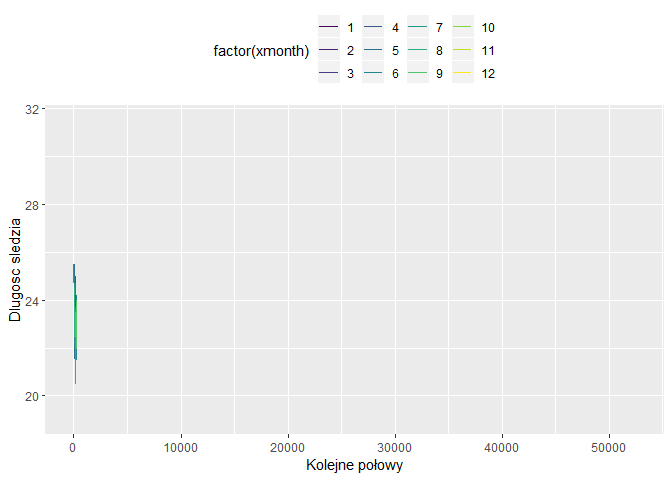

-   [Podsumowanie badań](#podsumowanie-badań)
-   [Wykorzystane biblioteki](#wykorzystane-biblioteki)
-   [Zapewnienie powtarzalności wyników przy każdym uruchomieniu raportu
    na tych samych
    danych](#zapewnienie-powtarzalności-wyników-przy-każdym-uruchomieniu-raportu-na-tych-samych-danych)
-   [Wstęp](#wstęp)
-   [Wczytywanie danych z pliku](#wczytywanie-danych-z-pliku)
-   [Rozmiar zbioru danych i podstawowe
    statystyki](#rozmiar-zbioru-danych-i-podstawowe-statystyki)
-   [Brakujące dane](#brakujące-dane)
-   [Szczegółowa analiza zbiorów
    wartości](#szczegółowa-analiza-zbiorów-wartości)
-   [Korelacja między zmiennymi](#korelacja-między-zmiennymi)
-   [Zmiana rozmiaru śledzia w
    czasie](#zmiana-rozmiaru-śledzia-w-czasie)
-   [Przewidywanie rozmiaru śledzia](#przewidywanie-rozmiaru-śledzia)
    -   [Random Forest](#random-forest)
    -   [Regresja liniowa](#regresja-liniowa)
    -   [kNN](#knn)
    -   [Porównanie modeli](#porównanie-modeli)
-   [Analiza ważnośći atrybutów najlepszego znalezionego modelu
    regresji](#analiza-ważnośći-atrybutów-najlepszego-znalezionego-modelu-regresji)

data wygenerowania: ‘2019-listopad-13’

Podsumowanie badań
==================

***\[TODO\]*** podsumowanie calego raportu

Wykorzystane biblioteki
=======================

Do analizy danych i stworzenia raportu z tej analizy zostały
wykorzystane następujące biblioteki: - datasets  
- corrplot  
- ggplot2  
- gganimate  
- dplyr  
- gridExtra  
- gifski package  
- imputeTS  
- caret

Zapewnienie powtarzalności wyników przy każdym uruchomieniu raportu na tych samych danych
=========================================================================================

Aby zapewnić powtarzalność próbkowań i losowań liczb (m. inn. przy
próbkowaniu zbioru) przy każdym odpaleniu programu ustawiono stałe
ziarno.

    set.seed(23)

Wstęp
=====

W podanym sprawozdaniu użyto zbioru danych sledzie.csv pobranego ze
strony
<a href="http://www.cs.put.poznan.pl/alabijak/emd/projekt/sledzie.csv" class="uri">http://www.cs.put.poznan.pl/alabijak/emd/projekt/sledzie.csv</a>
. Zbiór ten opisuje rozmiary śledzi i warunki, w których żyją od 60-ciu
lat. Kolejne kolumny w zbiorze danych to:  
- **length**: długość złowionego śledzia \[cm\];  
- **cfin1**: dostępność planktonu \[zagęszczenie Calanus finmarchicus
gat. 1\];  
- **cfin2**: dostępność planktonu \[zagęszczenie Calanus finmarchicus
gat. 2\];  
- **chel1**: dostępność planktonu \[zagęszczenie Calanus helgolandicus
gat. 1\];  
- **chel2**: dostępność planktonu \[zagęszczenie Calanus helgolandicus
gat. 2\];  
- **lcop1**: dostępność planktonu \[zagęszczenie widłonogów gat. 1\];  
- **lcop2**: dostępność planktonu \[zagęszczenie widłonogów gat. 2\];  
- **fbar**: natężenie połowów w regionie \[ułamek pozostawionego
narybku\];  
- **recr**: roczny narybek \[liczba śledzi\];  
- **cumf**: łączne roczne natężenie połowów w regionie \[ułamek
pozostawionego narybku\];  
- **totaln**: łączna liczba ryb złowionych w ramach połowu \[liczba
śledzi\];  
- **sst**: temperatura przy powierzchni wody \[°C\];  
- **sal**: poziom zasolenia wody \[Knudsen ppt\];  
- **xmonth**: miesiąc połowu \[numer miesiąca\];  
- **nao**: oscylacja północnoatlantycka \[mb\].  
Wiersze w zbiorze są uporządkowane chronologicznie.

Wczytywanie danych z pliku
==========================

    names <- read.table("sledzie.csv", nrow=1, stringsAsFactors = FALSE, sep = ",")
    data <- read.table("sledzie.csv", header=TRUE, stringsAsFactors = FALSE, sep=",")
    head(data)

    ##   X length   cfin1   cfin2   chel1    chel2   lcop1    lcop2  fbar   recr
    ## 1 0   23.0 0.02778 0.27785 2.46875        ? 2.54787 26.35881 0.356 482831
    ## 2 1   22.5 0.02778 0.27785 2.46875 21.43548 2.54787 26.35881 0.356 482831
    ## 3 2   25.0 0.02778 0.27785 2.46875 21.43548 2.54787 26.35881 0.356 482831
    ## 4 3   25.5 0.02778 0.27785 2.46875 21.43548 2.54787 26.35881 0.356 482831
    ## 5 4   24.0 0.02778 0.27785 2.46875 21.43548 2.54787 26.35881 0.356 482831
    ## 6 5   22.0 0.02778 0.27785 2.46875 21.43548 2.54787        ? 0.356 482831
    ##        cumf   totaln           sst      sal xmonth nao
    ## 1 0.3059879 267380.8 14.3069330186 35.51234      7 2.8
    ## 2 0.3059879 267380.8 14.3069330186 35.51234      7 2.8
    ## 3 0.3059879 267380.8 14.3069330186 35.51234      7 2.8
    ## 4 0.3059879 267380.8 14.3069330186 35.51234      7 2.8
    ## 5 0.3059879 267380.8 14.3069330186 35.51234      7 2.8
    ## 6 0.3059879 267380.8 14.3069330186 35.51234      7 2.8

Jak widać, wczytane dane zawierają znak “?” przy nieznanych danych.

Wyświetlenie klas poszczególnych kolumn:

    sapply(data, class)

    ##           X      length       cfin1       cfin2       chel1       chel2 
    ##   "integer"   "numeric" "character" "character" "character" "character" 
    ##       lcop1       lcop2        fbar        recr        cumf      totaln 
    ## "character" "character"   "numeric"   "integer"   "numeric"   "numeric" 
    ##         sst         sal      xmonth         nao 
    ## "character"   "numeric"   "integer"   "numeric"

Dane zawierające znak “?” zostały zinterpretowane jako tekst.  
Z uwagi na występowanie brakujących danych konieczna była zmiana “?” na
“NA” wraz ze zmianą typu danych z character na numeric:

    data[data=="?"] <- NA

Po zmianie znaku “?” na wartość NA zmianiono typ danych kolumn z
nieznanymi wartościami na wartości numeryczne.

    data$cfin1 <- as.numeric(data$cfin1)
    data$cfin2 <- as.numeric(data$cfin2)
    data$chel1 <- as.numeric(data$chel1)
    data$chel2 <- as.numeric(data$chel2)
    data$lcop1 <- as.numeric(data$lcop1)
    data$lcop2 <- as.numeric(data$lcop2)
    data$sst <- as.numeric(data$sst)

    head(data)

    ##   X length   cfin1   cfin2   chel1    chel2   lcop1    lcop2  fbar   recr
    ## 1 0   23.0 0.02778 0.27785 2.46875       NA 2.54787 26.35881 0.356 482831
    ## 2 1   22.5 0.02778 0.27785 2.46875 21.43548 2.54787 26.35881 0.356 482831
    ## 3 2   25.0 0.02778 0.27785 2.46875 21.43548 2.54787 26.35881 0.356 482831
    ## 4 3   25.5 0.02778 0.27785 2.46875 21.43548 2.54787 26.35881 0.356 482831
    ## 5 4   24.0 0.02778 0.27785 2.46875 21.43548 2.54787 26.35881 0.356 482831
    ## 6 5   22.0 0.02778 0.27785 2.46875 21.43548 2.54787       NA 0.356 482831
    ##        cumf   totaln      sst      sal xmonth nao
    ## 1 0.3059879 267380.8 14.30693 35.51234      7 2.8
    ## 2 0.3059879 267380.8 14.30693 35.51234      7 2.8
    ## 3 0.3059879 267380.8 14.30693 35.51234      7 2.8
    ## 4 0.3059879 267380.8 14.30693 35.51234      7 2.8
    ## 5 0.3059879 267380.8 14.30693 35.51234      7 2.8
    ## 6 0.3059879 267380.8 14.30693 35.51234      7 2.8

    sapply(data, class)

    ##         X    length     cfin1     cfin2     chel1     chel2     lcop1 
    ## "integer" "numeric" "numeric" "numeric" "numeric" "numeric" "numeric" 
    ##     lcop2      fbar      recr      cumf    totaln       sst       sal 
    ## "numeric" "numeric" "integer" "numeric" "numeric" "numeric" "numeric" 
    ##    xmonth       nao 
    ## "integer" "numeric"

Rozmiar zbioru danych i podstawowe statystyki
=============================================

    paste("Wczytane dane zawierają ", nrow(data), " rekordów oraz ", ncol(data), " kolumn.", sep=" ")

    ## [1] "Wczytane dane zawierają  52582  rekordów oraz  16  kolumn."

Podsumowanie wartości danych:

    summary(data)

    ##        X             length         cfin1             cfin2        
    ##  Min.   :    0   Min.   :19.0   Min.   : 0.0000   Min.   : 0.0000  
    ##  1st Qu.:13145   1st Qu.:24.0   1st Qu.: 0.0000   1st Qu.: 0.2778  
    ##  Median :26291   Median :25.5   Median : 0.1111   Median : 0.7012  
    ##  Mean   :26291   Mean   :25.3   Mean   : 0.4458   Mean   : 2.0248  
    ##  3rd Qu.:39436   3rd Qu.:26.5   3rd Qu.: 0.3333   3rd Qu.: 1.7936  
    ##  Max.   :52581   Max.   :32.5   Max.   :37.6667   Max.   :19.3958  
    ##                                 NA's   :1581      NA's   :1536     
    ##      chel1            chel2            lcop1              lcop2       
    ##  Min.   : 0.000   Min.   : 5.238   Min.   :  0.3074   Min.   : 7.849  
    ##  1st Qu.: 2.469   1st Qu.:13.427   1st Qu.:  2.5479   1st Qu.:17.808  
    ##  Median : 5.750   Median :21.673   Median :  7.0000   Median :24.859  
    ##  Mean   :10.006   Mean   :21.221   Mean   : 12.8108   Mean   :28.419  
    ##  3rd Qu.:11.500   3rd Qu.:27.193   3rd Qu.: 21.2315   3rd Qu.:37.232  
    ##  Max.   :75.000   Max.   :57.706   Max.   :115.5833   Max.   :68.736  
    ##  NA's   :1555     NA's   :1556     NA's   :1653       NA's   :1591    
    ##       fbar             recr              cumf             totaln       
    ##  Min.   :0.0680   Min.   : 140515   Min.   :0.06833   Min.   : 144137  
    ##  1st Qu.:0.2270   1st Qu.: 360061   1st Qu.:0.14809   1st Qu.: 306068  
    ##  Median :0.3320   Median : 421391   Median :0.23191   Median : 539558  
    ##  Mean   :0.3304   Mean   : 520367   Mean   :0.22981   Mean   : 514973  
    ##  3rd Qu.:0.4560   3rd Qu.: 724151   3rd Qu.:0.29803   3rd Qu.: 730351  
    ##  Max.   :0.8490   Max.   :1565890   Max.   :0.39801   Max.   :1015595  
    ##                                                                        
    ##       sst             sal            xmonth            nao          
    ##  Min.   :12.77   Min.   :35.40   Min.   : 1.000   Min.   :-4.89000  
    ##  1st Qu.:13.60   1st Qu.:35.51   1st Qu.: 5.000   1st Qu.:-1.89000  
    ##  Median :13.86   Median :35.51   Median : 8.000   Median : 0.20000  
    ##  Mean   :13.87   Mean   :35.51   Mean   : 7.258   Mean   :-0.09236  
    ##  3rd Qu.:14.16   3rd Qu.:35.52   3rd Qu.: 9.000   3rd Qu.: 1.63000  
    ##  Max.   :14.73   Max.   :35.61   Max.   :12.000   Max.   : 5.08000  
    ##  NA's   :1584

Ilość brakujących danych dla poszczególnych kolumn:

    missingData <- sapply(data, function(x) sum(is.na(x)))
    missingData

    ##      X length  cfin1  cfin2  chel1  chel2  lcop1  lcop2   fbar   recr 
    ##      0      0   1581   1536   1555   1556   1653   1591      0      0 
    ##   cumf totaln    sst    sal xmonth    nao 
    ##      0      0   1584      0      0      0

Wykres ilości brakujących danych w zbiorze:

    plot(x = factor(names(missingData)), y = missingData, main="Wykres ilości brakujących danych w zbiorze", xlab="atrybut", ylab = "ilość brakujących artybutów")

Jak widać zbiór danych zawiera znaczną ilość brakujących danych, co może
utrudnić ich późniejszą analizę.

Brakujące dane
==============

    library("imputeTS")
    data$cfin1 <- na_kalman(data$cfin1)
    data$cfin2 <- na_kalman(data$cfin2)
    data$chel1 <- na_kalman(data$chel1)
    data$chel2 <- na_kalman(data$chel2)
    data$lcop1 <- na_kalman(data$lcop1)
    data$lcop2 <- na_kalman(data$lcop2)
    data$sst <- na_kalman(data$sst)

Ilosć brakujących danych w poszczególnych kolumnach po zastosowaniu
filtru Kalman’a:

    missingData <- sapply(data, function(x) sum(is.na(x)))
    missingData

    ##      X length  cfin1  cfin2  chel1  chel2  lcop1  lcop2   fbar   recr 
    ##      0      0      0      0      0      0      0      0      0      0 
    ##   cumf totaln    sst    sal xmonth    nao 
    ##      0      0      0      0      0      0

Z powyższej tabeli wynika, że filtr Kalman’a poradził sobie ze
wszystkimi brakującymi danymi.

Szczegółowa analiza zbiorów wartości
====================================

Poniżej przedstawiono rozkłady wszystkich wartośi w zbiorze danych

    library(ggplot2)
    library(ggExtra)

    lengthDissPlot <- ggplot(data, aes(x=length)) + geom_histogram(binwidth=.5, colour="black", fill="white")
    cfin1DissPlot <- ggplot(data, aes(x=cfin1)) + geom_histogram(binwidth=1, colour="black", fill="white")
    cfin2DissPlot <- ggplot(data, aes(x=cfin2)) + geom_histogram(binwidth=1, colour="black", fill="white")
    chel1DissPlot <- ggplot(data, aes(x=chel1)) + geom_histogram(binwidth=.5, colour="black", fill="white")
    chel2DissPlot <- ggplot(data, aes(x=chel2)) + geom_histogram(binwidth=.5, colour="black", fill="white")
    lcop1DissPlot <- ggplot(data, aes(x=lcop1)) + geom_histogram(binwidth=.5, colour="black", fill="white")
    lcop2DissPlot <- ggplot(data, aes(x=lcop2)) + geom_histogram(binwidth=.5, colour="black", fill="white")
    fbarDissPlot <- ggplot(data, aes(x=fbar)) + geom_histogram(binwidth=.05, colour="black", fill="white")
    recrDissPlot <- ggplot(data, aes(x=recr)) + geom_histogram(binwidth=50000.0, colour="black", fill="white")
    cumfDissPlot <- ggplot(data, aes(x=cumf)) + geom_histogram(binwidth=.02, colour="black", fill="white")
    totalnDissPlot <- ggplot(data, aes(x=totaln)) + geom_histogram(binwidth=1000.0, colour="black", fill="white")
    sstDissPlot <- ggplot(data, aes(x=sst)) + geom_histogram(binwidth=.2, colour="black", fill="white")
    salDissPlot <- ggplot(data, aes(x=sal)) + geom_histogram(binwidth=.01, colour="black", fill="white")
    xmonthDissPlot <- ggplot(data, aes(x=xmonth)) + geom_histogram(binwidth=1.0, colour="black", fill="white")
    naoDissPlot <- ggplot(data, aes(x=nao)) + geom_histogram(binwidth=.5, colour="black", fill="white")

    require(gridExtra)
    grid.arrange(lengthDissPlot,cfin1DissPlot,cfin2DissPlot ,chel1DissPlot ,chel2DissPlot,lcop1DissPlot,lcop2DissPlot ,fbarDissPlot ,
    recrDissPlot ,cumfDissPlot ,totalnDissPlot ,sstDissPlot ,salDissPlot ,xmonthDissPlot ,naoDissPlot, nrow = 5, ncol=3)

Z powyższych wykresów wynika, że jeśli chodzi o rozkład poszczególnych
atrybutów to zbiór nie jest zrównoważony.

Analizując długość śledzia (*length*) można zauważyć, że ten atrybut
przyjmuje rozkład zbliżony do rozkładu normalnego. W zbiorze danych
znajduje się najwięcej śledzi o długości równej 25-26cm. Ze
wcześniejszej analizy podsumowującej dane wynika także, że minimalna
długość śledzia w zbiorze to 19cm, a maksymalna to 32.5cm. Średnia
długość 25.3cm, a mediana to 25,5.

Jeśli chodzi o atrybut jakim jest dostępność planktonu (zarówno
zagęszczenie *Calanus finmarchicus gat. 1* jak i *Calanus finmarchicus
gat. 2*) to można zauważyć że w zbiorze znalazło się znacznie więcej
danych z łowisk o mniejszej dostępności planktonu omawianego gatunku. Ze
wcześniejszej analizy wiemy, że minimalna dostępność pierwszego gatunku
tego planktonu to 0, maksymalna: ok 37,67. Srednia to ok. 0,45 a mediana
to ok. 0,11. Jeśli chodzi o drugi gatunek planktonu *Calanus
finmarchicus* to jego minimalne zagęszczenie wynosi 0, maksymalne - ok.
19,4, średnia to ok. 2,03 a mediana - 0.7.

Kolejnym badanym atrybutem jest dostępność planktonu gatunku *Calanus
helgolandicus gat. 1* i *Calanus helgolandicus gat. 1*. W przypadku
pierwszego z nich w zbiorze znalazło się więcej śledzi złowionych na
łowisku o mniejszej zawartości planktonu. W Przypadku drugiego gatunku
planktonu rozkład ilości złowionych tam śledzi był bardziej rozłożony w
przedziale 0-40. O śledziach złapanych w miejscach gdzie zagęszczenie
omawianego planktonu drugiego gatunku osiąga przedział 40-60 można
powiedzieć że są towartości odstające. Jeśli chodzi o zagęszczenie
pierwszego gatunku to ze wcześniejszej analizy wynika, że atrubut
tenprzyjmuje minimalną wartość równą 0, a maksymalną równą 75. Jego
średnia występowania to ok. 10, a mediana to 5.75. Jeśli chodzi o
minimalną wartość dostępności planktonu drugiego gatunku *Calanus
helgolandicus* to jego minimalna wartość to ok. 5.2, maksymalna: ok.
57.7, średnia to ok. 21.2, a mediana wynosi około 21.7.

Ostatnim z planktonów, których dostępność badaliśmy są widłonogi dwóch
gatunków (*lcop1* i *lcop2*). Jeśli chodzi o pierwzszy z nich,
zdecydowanie więcej śledzi wyłowiono na łowisku o dostępności widłonogów
mniejszej niż 30. Jeśli chodzi o ich drugi gatunek to zagęszczenie
widłonogów największej ilości połowów znajduje się w przedziale 10-45.
Ze wcześniejszych badań wiemy, że minimalna wartość *lcop1* wynosi 0.3,
majsymalna 115.6, średnia 12.8, a mediana 7. Jeśli chodzi o drugi
gatunek widłonogów to ich minimalna wartość wynosi 7.8, maksymalna 68,7,
średnia ok. 28, a mediana: 24.8.

Kolejnym atrybutem jest natężenie połowów w regionie (ułamek
pozostawionego narybku) - *fbar*. Rozkład tego atrybutu jest zbliżony do
rozkładu normalnego. Z tabeli umieszczonej we wcześniejszej części badań
wynika, że minimalna wartość, jaką przyjmuje ten atrybut to ok. 0.07,
maksymalna ok. 0.85, a średnia i mediana to ok. 0.33.

Następnym z analizowanych atrybutów będzie ilość rocznego narybku (czyli
liczba śledzi) - *recr*. Z powyższego wykresu wynika, że większość
atrybutów w zbiorze przyjmuje małe wartości, a tym wyższa liczba śledzi,
tym mniejsza próbka danych w zniorze danych. Ze wcześniejszych badań
wynika, że minimalna wartość atrybutu *recr* wynosi ok. 140tys,
maksymalna 1.5mln, średnia ok. 520tys, a mediana ok. 421 000.

Rozkład atrybutu *cumf*, czyli łączne roczne natężenie połowów w
regionie (ułamek pozostawionego narybku) jest niemalże równomierny.
Tylko dla niektorych wartości próbka danych w zniorze jest niższa.
Minimalna wartość, jaką przyjmuje ten atrybut to ok. 0.07, maksymalna:
ok. 0.4 a średnia i mediana - ok. 0.23.

Z wykresu zawierającego rozkład wartości atrybutu *totaln*,czyli łączną
liczbę ryb złowionych w ramach połowu (liczbę śledzi) wynika, że liczba
łowionych ryb była nierównomierna. Można zauważyć tylko, że bardzo dużą
liczbę przykłądów w zbiorze danych pokrywają połowy, w trakcie których
złowiono ok 750tys. śledzi. Ze wcześniejszych badań wynika, że minimalna
liczba śledzi złowionych w trakcie połowu to ok. 144 tysiące, maksymalna
- ok 1 milion, średnia - ok. 514tys., a mediana to ok 540tys.

-   sst: temperatura przy powierzchni wody \[°C\];

***\[TODO\] z nowymi wykresami ***

Jeśli chodzi o atrybut *sal*: poziom zasolenia wody \[Knudsen ppt\] to
zdecydowana większość przypadków w zbiorze danych przyjmowała jego
wartość w przedziale 35.50-35.55 . Minimalna wartość tego atrybutu w
całym zbiorze wyniosła 35.40, maksymalna: 35.61 a mediana i średnia:
35.51.

Następnym z atrybutów, które poddaliśmy analizie jest *xmonth*, czyli
miesiąc połowu (numer miesiąca). Rozkład tego atrybutu jest zbliżony do
rozkładu normalnego. Najmniej połowów miało miejsce w styczniu, a
najwięcej w sierpniu. Ponieważ atrybut wskazuje na numer miesiąca,
obliczanie dla niego wartości minimalnej i maksymalnej a także podawanie
średniej i mediany nie ma sensu.

Ostatnim z badanych parametrów łowisk jest *nao*: oscylacja
północnoatlantycka \[mb\]. Rozkład tego atrybuu jest nierównomierny.
Jego minimalna wartość to -4.89, maksymalna to 5.08, średnia wynosi
-0.09, a mediana 0.2.

Korelacja między zmiennymi
==========================

W niniejszej sekcji została przeanalizowana korelacja między
atrybutami.Na początek przedstawiono współczynniki korelacji wraz z
graficzną macierzą korelacji.

    res <- cor(data)

    library(corrplot)
    corrplot.mixed(res, tl.col = "black", tl.srt = 45)

Największa korelacja występuje między atrybutem *chel1* i *lcop1* -
czyli między dostępnością planktonu dwóch gatunków i wynosi ona 0.96.
Między *chel2* i *lcop2* - współczynnik korelacji wynosi 0.89, a między
*cumf* ( łączne roczne natężenie połowów w regionie) a *fbar* (natężenie
połowów w regionie): 0.82 (zależność między tymi ostatnimi wynika
prawdopodobnie z tego, że na podstawie jednego z tych atrybutów w
naturalny sposób oblicza się dtugi z nich). Wysoka korelacja występuje
także między *cfin2* a *lcop2*, gdzie współczynnik korelacji jest równy
0.65.

Bardzo niski, jednak ujemny współczynnik korelacji (wynoszący -0.55)
miedzy atrybutem *lcop1* a *neo* (oscylacja północnoatlantycka) świadczy
o wysokiej, ale odwrotnej zaleznosci tych atrybutów. Może to być
wyjaśnione z punktu widzenia przyrody przez to, że plankton może być
przenoszony przez prądy morskie.

Niski ujemny współczynnik korelacji wskazujący na wysoką korelacje
atrybutów można też zauważyć między *cumf* (łączne roczne natężenie
połowów w regionie) a *totaln* (łączna liczba ryb złowionych w ramach
połowu) - wynosi on -0.71, gdzie taka zależność też jest naturalna.

Jeśli chodzi o atrybut, którego będą dotyczyć badania w dalszej części
pracy, czyli ługość śledzia, to jest najbardziej skorelowana z
temperaturą przy powierzchni wody, a współczynnik tej korelacji wynosi
-0.45 (czyli są to wartości odwrotnie zależne)

Żeby lepiej zwizualizować korelacje między omówionymi atrybutami
przedstawiono wykresy zależności tych atrybutów.

    plot(data[,c(5,7,16)])

W przypadku zaprezentowanych powyżej danych, zgodnie z wartościami
mieszczącymi się w macierzy korelacji, największą korelacje
(współczynnik korelacji wynoszący 0.96) widać między dostępnością
planktonu pierwszego gatunku Calanus helgolandicus (*chel1*) a
zagęszczeniem widłonogów z gatunku pierwszego (*lcop2*). Z wykresu
wynika, że im więcej jednego plantonu w łowisku, tym spotkać tam można
więcej drugiego z wymienionych planktonów.  
Zależność między *lcop2* a oscylacja północnoatlantycka *neo* nie jest
aż tak widoczna na wykresie (choć też da się ją zauważyć).

    plot(data[,c(6,8,4)])

Podobnie jak na poprzednim wykresie, i tu najbardziej widoczna jest
korelacja między dostępnością dwóch z gatunków planktonu.

    plot(data[,c(9,11,12)])

Na powyższym wykresie korelacji najbardziej widać odwrotnie
proporcjonalną zależność między *fbar* a *totaln* - współczynnik
korelacjiwynoszący -0.71) i *cumf* a *totaln*. Można wyraźnie zauważyć
że im więcej pierwszego z atrybutów, tym mniej drugiego i odwrotnie.  
Wysoce proporcjonalne są zmienne *fbar* i *cumf*.

Zmiana rozmiaru śledzia w czasie
================================

    library(ggplot2)
    library(gganimate)
    library(dplyr)

    sampled <- sample_n(data,  round(nrow(data)*0.1))

    p <- ggplot(
      sampled, aes(X, length, group = xmonth, color = factor(xmonth))) +
      geom_line() +
      scale_color_viridis_d() +
      labs(x = "Kolejne połowy", y = "Dlugosc sledzia") +
      theme(legend.position = "top")

    p + transition_reveal(X)

Z wykresu można zauważyć delikatny spadek śledzia w czasie. Choć na
początku rozmiar śledzia znaczie rośnie, to po którkim czasie zaczyna
już maleć.

Przewidywanie rozmiaru śledzia
==============================

W niniejszej sekcji zostanie podjęta próba stworzenia regresora
przewidującego rozmiar śledzia.

W niniejszym rozdziale postaramy się przewidzieć rozmiar śledzia z
wykorzystaniem różnych metod uczenia maszynowego. W tym celu na początek
dane zostaną podzielone na zbiór uczący (stanowiący 75% całego zbioru
danych) i testowy (stanowiący 25% całego zbioru danych).

Pierwszą rzaczą było usunięcie parametru X z danych.

    data <- data[, !(colnames(data) %in% c("X"))]

Do badań zostanie wykorzystana powtarzana ocena krzyżowa.

    library(caret)
    library(ggplot2)
    library(gganimate)
    library(dplyr)

    inTraining <- createDataPartition(y = data$length, p = .75,list = FALSE)

    training <- data[ inTraining, ]
    testing  <- data[-inTraining, ]

    ctrl <- trainControl( method = "repeatedcv", number = 5, repeats = 10)

Random Forest
-------------

Pierwszym z wykorzystanych algorytmów będzie Random Forest z liczbą
drzew w lesie równą 10.

    fitRandomForestF <- train(length ~ ., data = training, method = "rf", importance=T, trControl = ctrl, ntree = 10) 
    fitRandomForestF

    ## Random Forest 
    ## 
    ## 39438 samples
    ##    14 predictor
    ## 
    ## No pre-processing
    ## Resampling: Cross-Validated (5 fold, repeated 10 times) 
    ## Summary of sample sizes: 31549, 31550, 31550, 31552, 31551, 31552, ... 
    ## Resampling results across tuning parameters:
    ## 
    ##   mtry  RMSE      Rsquared   MAE      
    ##    2    1.161252  0.5053517  0.9173367
    ##    8    1.152068  0.5137172  0.9057114
    ##   14    1.153935  0.5122928  0.9068184
    ## 
    ## RMSE was used to select the optimal model using the smallest value.
    ## The final value used for the model was mtry = 8.

    rfClasses <- predict(fitRandomForestF, newdata = testing)
    rfClasses <- sapply(rfClasses, round, digits = 0)

    availableValues <- sapply(testing$length, round, digits = 0)
    levels <- unique(c(availableValues, rfClasses))

    confusionMatrix <- confusionMatrix(data = factor(rfClasses, levels = levels),   factor(availableValues, levels = levels))
    confusionMatrix

    ## Confusion Matrix and Statistics
    ## 
    ##           Reference
    ## Prediction   23   22   24   26   21   20   25   27   28   30   29   32
    ##         23  266  470  539   47   46   16   64    0    1    0    0    0
    ##         22    7   11   23    1    2    3    2    0    0    0    0    0
    ##         24  216  191  788  237   10    6  210   26    7    0    0    0
    ##         26   33   17  452 1645    0    0  377  371  444   11   11    2
    ##         21    0    0    0    0    0    0    0    0    0    0    0    0
    ##         20    0    0    0    0    0    0    0    0    0    0    0    0
    ##         25  146   92 1386 1558    2    2  730  185  123    1    3    1
    ##         27    4    5   83  709    0    0   77  359  713   23   46    1
    ##         28    0    0   11   60    0    0    4   40  180   16   21    0
    ##         30    0    0    0    0    0    0    0    1    0    0    0    0
    ##         29    0    0    0    2    0    0    0    0    5    0    1    0
    ##         32    0    0    0    0    0    0    0    0    0    0    0    0
    ##         31    0    0    0    0    0    0    0    0    0    0    0    0
    ##           Reference
    ## Prediction   31
    ##         23    0
    ##         22    0
    ##         24    0
    ##         26    1
    ##         21    0
    ##         20    0
    ##         25    0
    ##         27    1
    ##         28    0
    ##         30    0
    ##         29    0
    ##         32    0
    ##         31    0
    ## 
    ## Overall Statistics
    ##                                          
    ##                Accuracy : 0.3028         
    ##                  95% CI : (0.295, 0.3107)
    ##     No Information Rate : 0.324          
    ##     P-Value [Acc > NIR] : 1              
    ##                                          
    ##                   Kappa : 0.1589         
    ##                                          
    ##  Mcnemar's Test P-Value : NA             
    ## 
    ## Statistics by Class:
    ## 
    ##                      Class: 23 Class: 22 Class: 24 Class: 26 Class: 21
    ## Sensitivity            0.39583 0.0139949   0.24010    0.3862  0.000000
    ## Specificity            0.90515 0.9969251   0.90844    0.8065  1.000000
    ## Pos Pred Value         0.18357 0.2244898   0.46600    0.4890       NaN
    ## Neg Pred Value         0.96528 0.9408171   0.78224    0.7327  0.995435
    ## Prevalence             0.05113 0.0597991   0.24970    0.3240  0.004565
    ## Detection Rate         0.02024 0.0008369   0.05995    0.1252  0.000000
    ## Detection Prevalence   0.11024 0.0037279   0.12865    0.2559  0.000000
    ## Balanced Accuracy      0.65049 0.5054600   0.57427    0.5964  0.500000
    ##                      Class: 20 Class: 25 Class: 27 Class: 28 Class: 30
    ## Sensitivity           0.000000   0.49863   0.36558   0.12220 0.000e+00
    ## Specificity           1.000000   0.70043   0.86334   0.98698 9.999e-01
    ## Pos Pred Value             NaN   0.17262   0.17763   0.54217 0.000e+00
    ## Neg Pred Value        0.997946   0.91767   0.94399   0.89908 9.961e-01
    ## Prevalence            0.002054   0.11138   0.07471   0.11207 3.880e-03
    ## Detection Rate        0.000000   0.05554   0.02731   0.01369 0.000e+00
    ## Detection Prevalence  0.000000   0.32174   0.15376   0.02526 7.608e-05
    ## Balanced Accuracy     0.500000   0.59953   0.61446   0.55459 5.000e-01
    ##                      Class: 29 Class: 32 Class: 31
    ## Sensitivity          1.220e-02 0.0000000 0.0000000
    ## Specificity          9.995e-01 1.0000000 1.0000000
    ## Pos Pred Value       1.250e-01       NaN       NaN
    ## Neg Pred Value       9.938e-01 0.9996957 0.9998478
    ## Prevalence           6.239e-03 0.0003043 0.0001522
    ## Detection Rate       7.608e-05 0.0000000 0.0000000
    ## Detection Prevalence 6.086e-04 0.0000000 0.0000000
    ## Balanced Accuracy    5.058e-01 0.5000000 0.5000000

    confusionMatrix$overall

    ##       Accuracy          Kappa  AccuracyLower  AccuracyUpper   AccuracyNull 
    ##      0.3027998      0.1589146      0.2949512      0.3107357      0.3240262 
    ## AccuracyPValue  McnemarPValue 
    ##      0.9999999            NaN

***\[TODO\]*** opisac cos o tym

Regresja liniowa
----------------

Kolejnym przebadanym regresorem będzie regresja liniowa

    fitLR <- train(length ~ ., data = training, method = "lm", importance=T, trControl = ctrl)
    fitLR

    ## Linear Regression 
    ## 
    ## 39438 samples
    ##    14 predictor
    ## 
    ## No pre-processing
    ## Resampling: Cross-Validated (5 fold, repeated 10 times) 
    ## Summary of sample sizes: 31550, 31550, 31551, 31550, 31551, 31550, ... 
    ## Resampling results:
    ## 
    ##   RMSE      Rsquared   MAE     
    ##   1.361481  0.3200242  1.081655
    ## 
    ## Tuning parameter 'intercept' was held constant at a value of TRUE

    lrClasses <- predict(fitLR, newdata = testing)
    lrClasses <- sapply(lrClasses, round, digits = 0)

    availableValues <- sapply(testing$length, round, digits = 0)
    levels <- unique(c(availableValues, lrClasses))

    confusionMatrix <- confusionMatrix(data = factor(lrClasses, levels = levels),   factor(availableValues, levels = levels))
    confusionMatrix

    ## Confusion Matrix and Statistics
    ## 
    ##           Reference
    ## Prediction   23   22   24   26   21   20   25   27   28   30   29   32
    ##         23  100  150  223   25    4    1   36    2    0    0    0    0
    ##         22    0    0    0    0    0    0    0    0    0    0    0    0
    ##         24  265  419  847  342   48   25  213   33   12    3    1    0
    ##         26   98   77  929 1996    3    1  511  486  847   23   44    2
    ##         21    0    0    0    0    0    0    0    0    0    0    0    0
    ##         20    0    0    0    0    0    0    0    0    0    0    0    0
    ##         25  206  138 1242 1552    5    0  674  270  224    5    7    0
    ##         27    3    1   30  304    0    0   20  173  344   19   27    1
    ##         28    0    1   11   39    0    0   10   18   45    1    3    1
    ##         30    0    0    0    0    0    0    0    0    0    0    0    0
    ##         29    0    0    0    0    0    0    0    0    1    0    0    0
    ##         32    0    0    0    1    0    0    0    0    0    0    0    0
    ##         31    0    0    0    0    0    0    0    0    0    0    0    0
    ##           Reference
    ## Prediction   31
    ##         23    0
    ##         22    0
    ##         24    0
    ##         26    1
    ##         21    0
    ##         20    0
    ##         25    0
    ##         27    0
    ##         28    1
    ##         30    0
    ##         29    0
    ##         32    0
    ##         31    0
    ## 
    ## Overall Statistics
    ##                                          
    ##                Accuracy : 0.2918         
    ##                  95% CI : (0.284, 0.2996)
    ##     No Information Rate : 0.324          
    ##     P-Value [Acc > NIR] : 1              
    ##                                          
    ##                   Kappa : 0.1027         
    ##                                          
    ##  Mcnemar's Test P-Value : NA             
    ## 
    ## Statistics by Class:
    ## 
    ##                      Class: 23 Class: 22 Class: 24 Class: 26 Class: 21
    ## Sensitivity           0.148810    0.0000   0.25807    0.4687  0.000000
    ## Specificity           0.964641    1.0000   0.86200    0.6599  1.000000
    ## Pos Pred Value        0.184843       NaN   0.38361    0.3978       NaN
    ## Neg Pred Value        0.954614    0.9402   0.77734    0.7215  0.995435
    ## Prevalence            0.051126    0.0598   0.24970    0.3240  0.004565
    ## Detection Rate        0.007608    0.0000   0.06444    0.1519  0.000000
    ## Detection Prevalence  0.041159    0.0000   0.16799    0.3818  0.000000
    ## Balanced Accuracy     0.556725    0.5000   0.56003    0.5643  0.500000
    ##                      Class: 20 Class: 25 Class: 27 Class: 28 Class: 30
    ## Sensitivity           0.000000   0.46038   0.17617  0.030550   0.00000
    ## Specificity           1.000000   0.68759   0.93841  0.992717   1.00000
    ## Pos Pred Value             NaN   0.15591   0.18764  0.346154       NaN
    ## Neg Pred Value        0.997946   0.91044   0.93381  0.890272   0.99612
    ## Prevalence            0.002054   0.11138   0.07471  0.112066   0.00388
    ## Detection Rate        0.000000   0.05128   0.01316  0.003424   0.00000
    ## Detection Prevalence  0.000000   0.32890   0.07015  0.009890   0.00000
    ## Balanced Accuracy     0.500000   0.57398   0.55729  0.511633   0.50000
    ##                      Class: 29 Class: 32 Class: 31
    ## Sensitivity          0.000e+00 0.000e+00 0.0000000
    ## Specificity          9.999e-01 9.999e-01 1.0000000
    ## Pos Pred Value       0.000e+00 0.000e+00       NaN
    ## Neg Pred Value       9.938e-01 9.997e-01 0.9998478
    ## Prevalence           6.239e-03 3.043e-04 0.0001522
    ## Detection Rate       0.000e+00 0.000e+00 0.0000000
    ## Detection Prevalence 7.608e-05 7.608e-05 0.0000000
    ## Balanced Accuracy    5.000e-01 5.000e-01 0.5000000

    confusionMatrix$overall

    ##       Accuracy          Kappa  AccuracyLower  AccuracyUpper   AccuracyNull 
    ##      0.2917681      0.1026681      0.2840056      0.2996229      0.3240262 
    ## AccuracyPValue  McnemarPValue 
    ##      1.0000000            NaN

***\[TODO\]*** opisac cos o tym

kNN
---

Ostatnim z przebadanych algorytmów został kNN

    fitKNN <- train(length ~ ., data = training, method = "knn", importance=T, trControl = ctrl)
    fitKNN

    ## k-Nearest Neighbors 
    ## 
    ## 39438 samples
    ##    14 predictor
    ## 
    ## No pre-processing
    ## Resampling: Cross-Validated (5 fold, repeated 10 times) 
    ## Summary of sample sizes: 31550, 31550, 31552, 31549, 31551, 31550, ... 
    ## Resampling results across tuning parameters:
    ## 
    ##   k  RMSE      Rsquared   MAE      
    ##   5  1.142146  0.5216356  0.8975100
    ##   7  1.142783  0.5210950  0.8979623
    ##   9  1.143891  0.5201598  0.8987947
    ## 
    ## RMSE was used to select the optimal model using the smallest value.
    ## The final value used for the model was k = 5.

    knnClasses <- predict(fitKNN, newdata = testing)
    knnClasses <- sapply(knnClasses, round, digits = 0)

    availableValues <- sapply(testing$length, round, digits = 0)
    levels <- unique(c(availableValues, knnClasses))

    confusionMatrix <- confusionMatrix(data = factor(knnClasses, levels = levels),   factor(availableValues, levels = levels))
    confusionMatrix

    ## Confusion Matrix and Statistics
    ## 
    ##           Reference
    ## Prediction   23   22   24   26   21   20   25   27   28   30   29   32
    ##         23  280  480  565   45   48   18   70    1    1    0    0    0
    ##         22    1    3    6    0    0    2    1    0    0    0    0    0
    ##         24  210  204  800  230   10    6  212   25    6    0    0    0
    ##         26   33   15  460 1710    0    0  395  394  466   12   17    1
    ##         21    0    0    0    0    0    0    0    0    0    0    0    0
    ##         20    0    0    0    0    0    0    0    0    0    0    0    0
    ##         25  143   80 1369 1564    2    1  712  176  119    1    2    1
    ##         27    5    4   69  634    0    0   71  342  671   19   40    1
    ##         28    0    0   13   76    0    0    3   44  210   19   23    1
    ##         30    0    0    0    0    0    0    0    0    0    0    0    0
    ##         29    0    0    0    0    0    0    0    0    0    0    0    0
    ##         32    0    0    0    0    0    0    0    0    0    0    0    0
    ##         31    0    0    0    0    0    0    0    0    0    0    0    0
    ##           Reference
    ## Prediction   31
    ##         23    0
    ##         22    0
    ##         24    0
    ##         26    1
    ##         21    0
    ##         20    0
    ##         25    0
    ##         27    0
    ##         28    1
    ##         30    0
    ##         29    0
    ##         32    0
    ##         31    0
    ## 
    ## Overall Statistics
    ##                                           
    ##                Accuracy : 0.3087          
    ##                  95% CI : (0.3008, 0.3166)
    ##     No Information Rate : 0.324           
    ##     P-Value [Acc > NIR] : 0.9999          
    ##                                           
    ##                   Kappa : 0.1632          
    ##                                           
    ##  Mcnemar's Test P-Value : NA              
    ## 
    ## Statistics by Class:
    ## 
    ##                      Class: 23 Class: 22 Class: 24 Class: 26 Class: 21
    ## Sensitivity            0.41667 0.0038168   0.24375    0.4015  0.000000
    ## Specificity            0.90154 0.9991908   0.90844    0.7981  1.000000
    ## Pos Pred Value         0.18568 0.2307692   0.46976    0.4880       NaN
    ## Neg Pred Value         0.96631 0.9403701   0.78306    0.7356  0.995435
    ## Prevalence             0.05113 0.0597991   0.24970    0.3240  0.004565
    ## Detection Rate         0.02130 0.0002282   0.06086    0.1301  0.000000
    ## Detection Prevalence   0.11473 0.0009890   0.12956    0.2666  0.000000
    ## Balanced Accuracy      0.65910 0.5015038   0.57610    0.5998  0.500000
    ##                      Class: 20 Class: 25 Class: 27 Class: 28 Class: 30
    ## Sensitivity           0.000000   0.48634   0.34827   0.14257   0.00000
    ## Specificity           1.000000   0.70394   0.87551   0.98458   1.00000
    ## Pos Pred Value             NaN   0.17074   0.18427   0.53846       NaN
    ## Neg Pred Value        0.997946   0.91620   0.94330   0.90097   0.99612
    ## Prevalence            0.002054   0.11138   0.07471   0.11207   0.00388
    ## Detection Rate        0.000000   0.05417   0.02602   0.01598   0.00000
    ## Detection Prevalence  0.000000   0.31726   0.14121   0.02967   0.00000
    ## Balanced Accuracy     0.500000   0.59514   0.61189   0.56357   0.50000
    ##                      Class: 29 Class: 32 Class: 31
    ## Sensitivity           0.000000 0.0000000 0.0000000
    ## Specificity           1.000000 1.0000000 1.0000000
    ## Pos Pred Value             NaN       NaN       NaN
    ## Neg Pred Value        0.993761 0.9996957 0.9998478
    ## Prevalence            0.006239 0.0003043 0.0001522
    ## Detection Rate        0.000000 0.0000000 0.0000000
    ## Detection Prevalence  0.000000 0.0000000 0.0000000
    ## Balanced Accuracy     0.500000 0.5000000 0.5000000

    plot(fitKNN)

    confusionMatrix$overall

    ##       Accuracy          Kappa  AccuracyLower  AccuracyUpper   AccuracyNull 
    ##      0.3086579      0.1631575      0.3007658      0.3166348      0.3240262 
    ## AccuracyPValue  McnemarPValue 
    ##      0.9999244            NaN

***\[TODO\]*** opisac cos o tym

Porównanie modeli
-----------------

Na koniec modele zostały porównane na podstawie miary średniej
kwadratowej błędów RMSE (w przypadku tej miary, im mniejszą wartość
osiągnie algorytm, tym jest lepszy) i współczynnik determinacji
R2 (dopsowanie modelu jest tym lepsze im wartość
R2 jest bliższa jedności):

    x <- list(randomForest = fitRandomForestF, linearRegression = fitLR, kNN = fitKNN) %>% resamples()

    dotplot(x, metric = "RMSE")

    dotplot(x, metric = "Rsquared")

Analiza ważnośći atrybutów najlepszego znalezionego modelu regresji
===================================================================

***\[TODO\]*** Analiza ważności atrybutów najlepszego znalezionego
modelu regresji. Analiza ważności atrybutów powinna stanowić próbę
odpowiedzi na pytanie: co sprawia, że rozmiar śledzi zaczął w pewnym
momencie maleć.  
***\[TODO\]*** sprawdzic czy po wywaleniu x nadal knn

Najlepszym znalezionym modelem regresji okazał się być algorytm kNN, dla
którego przeanalizowaliśmy ważność atrybutów:

    ggplot(varImp(fitKNN))

    ggplot(varImp(fitRandomForestF))

    ggplot(varImp(fitLR))

***\[TODO\]*** opisac najlepszy i sprawdzic czy to knn tak jak w piosie
nad kodem
